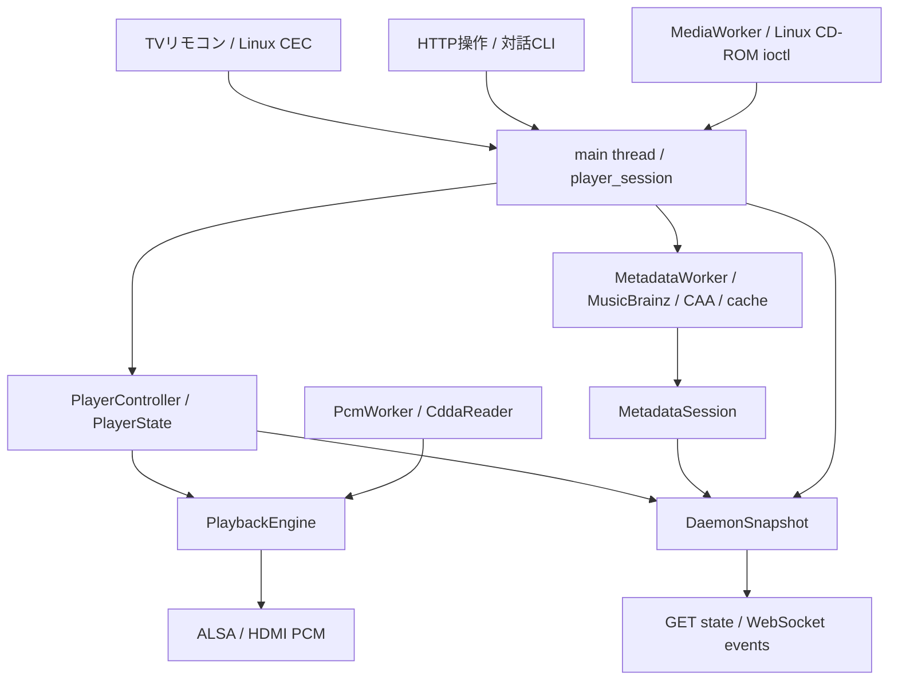

# 基本設計

## 目的と対象

物理Audio CDを入れ、TVリモコンで操作できる据え置きプレイヤーを実現する。
開発環境はRaspberry Pi OS Lite、C++20/CMake。将来Buildrootへ移植可能な小さなnative daemonを目指す。
一般的な音楽ライブラリ管理、ripping、desktop操作を主用途にはしない。

追加の製品目標として、再生PCMについて「観測した事実、採用理由、未確認事項」を説明できるようにする。
音質や完全性を観測以上に主張しない。優先順位とtarget構成は
[読み取り信頼性の拡張設計案](integrity-design.md)に定義する。以下の構成図と状態は現行実装であり、
検証・provenance・technical status UIはまだ含まない。

| 要求 | 現在の状態 |
|---|---|
| CD挿入・取り出しを認識しTOCに従って再生 | 実装済み。音声のみのCDが対象 |
| HDMIへ2ch PCM出力、CECで操作 | 実装・通常動作確認済み |
| metadataなし・ネットワーク障害時にも再生可能 | metadataを独立した任意機能として実装 |
| 一回のeject操作を保持し、待機後に実行 | HTTP経由で実装。失敗はEJECT_ERRORとして公開 |
| 非rootで常駐、signalで正常終了 | systemd・signalfdを利用 |
| TVに曲名・ジャケット・位置表示 | 状態APIまで実装。UIは未実装 |
| Linux起動画面を見せない家電起動 | quiet boot・kiosk・専用imageは未実装 |
| PCMの読み取り根拠・不確実性を説明する | 拡張設計案作成済み、実装前レビュー待ち |

## ブロック図

単一process。main threadが再生・media・metadataの正規状態を所有する。
PlayerController、MediaStateTracker、MetadataSessionは別々の責務を持ち、
DaemonSnapshotはそのコピーを公開する。CEC、API、将来のUIが独自の再生状態を所有しない。

| 実行場所 | 責務 |
|---|---|
| main thread | CEC、操作適用、状態遷移、ALSA nonblocking出力、API、終了signal |
| PcmWorker 1本 | reader所有、blocking CD-DA read、PCM先読み |
| MediaWorker 1本 | media観測、TOC、ejectの逐次実行 |
| MetadataWorker 任意1本 | HTTP、JSON変換、cache。PlayerStateは変更しない |

library内部の補助threadを除いた構成であり、thread poolは使わない。
O_NONBLOCKで開いたCD deviceでもioctlは待ち得るためworkerに隔離する。

## 正規モデルと単位

DiscTocは連続した番号のTrackとleadout_lbaを持つ。開始位置はint32 LBA、長さはint64 CD frame。
1 CD frameは1/75秒、2352 bytes、588 stereo sample frames（1176個のint16 sample）である。
内部PCMは44.1 kHz・stereo・signed 16-bit host endian。
MusicBrainz向け150 frame加算はmetadata境界だけで行い、DiscTocを変更しない。

## ライフサイクル

1. 起動時はPlayerState=NO_DISC。CECの準備を状態確認しながら待つ。
2. media観測でAudio CDを検出するとTOCを取得・検証し、先頭trackのSTOPPEDになる。
3. 任意のmetadata lookupを非同期に開始する。再生操作はmetadata完了を待たない。
4. PlayでPCM先読み後にALSA出力。Pause/Seek/Track変更では古いPCMを無効化する。
5. 取り出しを観測するとTOC・metadataを無効化しNO_DISCへ戻る。
6. API ejectはEJECTINGとして要求を保持し、reader解放とmedia workerの空きを待って実行する。
7. SIGINT/SIGTERMでは音声を止め、workerをjoinして終了する。

再生状態はNO_DISC / STOPPED / PLAYING / PAUSED。
media状態はNO_DISC / LOADING / AUDIO_READY / UNSUPPORTED / EJECTING / EJECT_ERROR。
metadata状態はNOT_REQUESTED / LOADING / AVAILABLE / NOT_FOUND / AMBIGUOUS / ERROR。
これらは同じenumへ統合しない。PLAYINGとmetadata ERRORは同時に成立する。

## 終了・障害境界

CD読み取り失敗は再生を停止しreaderを破棄する。ALSA underrunだけは再bufferして復旧する。
通常のmetadata通信・解析失敗はmetadata ERRORとなり、再生を止めない。
進行中kernel ioctlの強制中断は実装しないため、終了やejectの完了時間に上限を保証しない。
systemdは停止期限30秒を持つが、割り込み不能なkernel待ちを即時解消する保証はない。

将来課題は[検証状況と残課題](verification.md)を参照する。
