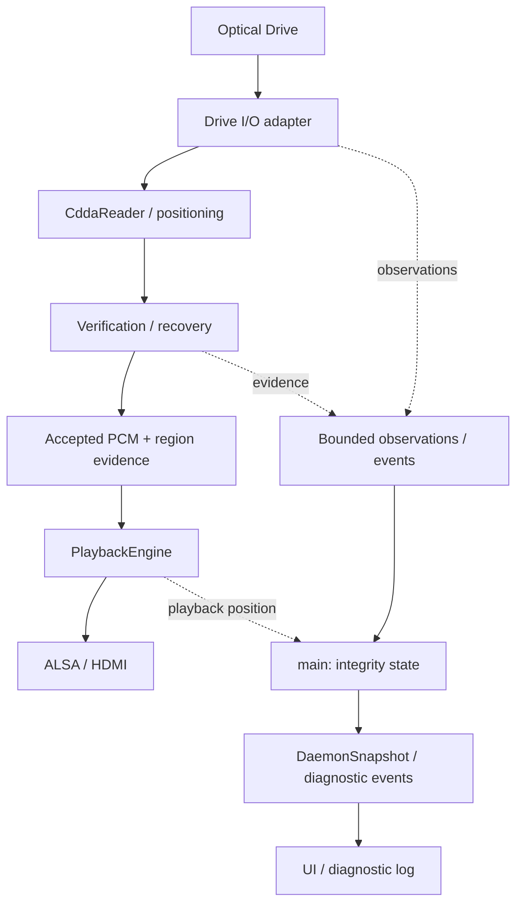
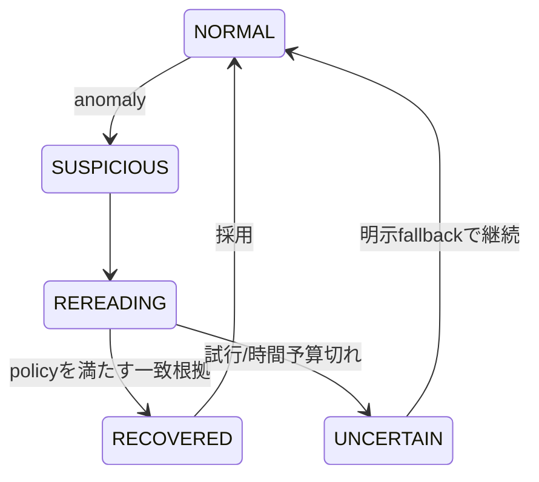

# 読み取り信頼性・説明可能性の仕様

この文書は読み取り信頼性（integrity）の横断仕様であり、基本・機能・詳細設計の一部である。
2026-09-25にDevelopmentの拡張案を統合した。実装済みの契約は
[機能設計](functional-design.md)と[詳細設計](detailed-design.md)、実機確認範囲は
[検証状況](../development/verification.md)を参照する。

以下では、継続して守る原則と未実装の要求を定義する。未実装の要求を統合したことは、
現在のCLI/APIで利用可能になったことを意味しない。型名・追加JSON field・endpoint名・
上限の候補値は明示したとおり暫定であり、公開前に互換性と実測を基に確定する。

## 実装との対応

| 区分 | 内容 |
|---|---|
| 実装済み | read-only能力probe、UNKNOWNモデル、区間付きReadEvidence、stream世代、ALSA再生head推定、bounded event、technical status |
| 実装済み | 先読み容量・開始閾値、drive access直列化、single/repeat、ReadPolicyの停止境界でのruntime適用 |
| 未実装の要求 | 速度設定、overlap/cache対策、C2とtrust評価、offset、能力別strategy、詳細provenance/coverage、外部照合 |
| 未確定の詳細 | MMC transport/command、cache対策手順、mode既定値、詳細履歴の容量、診断protocol、照合サービス・依存library |

現在の公開型は[ReadEvidence / ReadDiagnostics](../../include/integrity_state.hpp)、
[DriveCapabilities](../../include/drive_capabilities.hpp)、[ReadPolicy](../../include/read_policy.hpp)、
[PlayerEvent](../../include/player_event.hpp)を正とする。後述の拡張モデルと同名でも同一の契約とは限らない。
現在のeventはREAD_OBSERVEDで、`WS /api/events`はsnapshot配信である。
専用diagnostic stream、device/disc generationの公開、policy revision、track全域のcoverageはまだない。

未実装項目の着手・進捗・完了条件は[残課題一覧](../development/backlog.md)で追跡する。
phase番号は段階の対応付けであり、phaseの一部分を実装しただけで全体を完了とはしない。

## 1. 目的と原則

「現在再生しているPCMを、どの観測と検証に基づいて採用したか」を説明する。
音質改善や原PCMの完全な復元を主張する機能ではない。
優先順位はcorrectness、truthfulness、explainability、drive independence、graceful degradation、
playback continuity、quiet operation、extensibility、UI simplicityとする。

- read成功は証拠であり、正しい原PCMの証明ではない。
- C2非検出、複数read一致、外部照合成功、offset補正は別々の事実である。
- capability UNKNOWNをNOへ、offset不明を0へ変換しない。
- backend名やSECUREという設定だけを根拠に「検証済み」と表示しない。
- UI/診断接続の停止・遅延がaudio処理を待たせてはならない。
- 不明・未解決・代替PCMの使用を隠して再生継続を成功扱いにしない。

## 2. 現行実装と追加要求の境界

観測core、technical status、先読み設定、drive access直列化、任意の反復一致は現行設計へ統合した。
追加要求の中心はC2の取得と信頼性評価、cache独立性、overlap、offset、詳細provenance、
能力に応じたstrategy選択、外部照合である。ReadPolicyの稼働中切替は実装・自動試験済みで、
通常CDでPLAYING/PAUSED中の保留とSTOPPED境界での適用を確認した。現在の小さなReadPolicyと、
以下の全要素を備えた将来policyは区別する。

初期の依存調査では観測coreへの新規libraryは不要だった。MMC/C2/cacheはLinux UAPIと
drive/bridgeの挙動を確認してから選び、外部照合のprotocol・利用条件は着手時に再調査する。
追加要求の統合だけを理由に既存reader、ALSA、CEC、metadataを再設計しない。

## 3. 目標構成と所有権

以下は未実装部分も含む目標構成である。現行の所有権を保って段階的に拡張する。



Drive Adapterは責務の境界であり、初期段階で全backendを巨大なclass階層へ置き換えない。
既存LinuxIoctlReaderのtransport callback、MediaWorkerのcallbackをprobe/試験の差し替え点に使う。
vendor/model固有の対応が必要になったらadapter側へ閉じ込め、適用条件と根拠を公開する。

PCM reader・検証器はPcmWorker側、PlayerStateと公開integrityはmain側で所有する。
検証はPCMを採用する前の処理であり、UIとは独立。観測は小さな値をqueueで渡す。
既存TOC、metadata、CEC、ALSAを別のlibraryへ移さない。追加thread poolは不要。

## 4. 拡張データモデル（未実装部分を含む）

ここでの名称は目標モデルの責務を表す。現行型への追加方法・公開名は実装時に確定する。
既存PlaybackStateを再定義しない。

| 型 | 主な情報・寿命 |
|---|---|
| CapabilityValue<T> | optional value、evidence一覧、観測時刻、適用範囲、probe error |
| DriveCapabilities | identity、DAE、C2 support/trust、cache、accurate stream、speed control、offset |
| DriveState | device generation、接続/probe状態、要求速度・報告速度・実測throughput |
| ReadPolicy | 希望する検証、時間/試行予算、buffer、未解決時動作 |
| ReadStrategy | 選択された手順、使用backend、利用可能な観測、降格理由 |
| ReadState | IDLE/READING/VERIFYING/RECOVERING/BUFFERING/FAILED、read対象区間 |
| RegionIntegrity | 区間、観測・比較・独立性、offset、採用理由、policy revision |
| IntegrityStats | 試行数、採用区間、recovered/uncertain量、外部照合範囲 |
| ReadProvenance | 問題区間のReadAttempt一覧、採用候補、比較とfallbackの理由 |
| PlayerEvent | machine-readable type、severity、presentation、世代・区間・payload |

bool能力はYES/NO/UNKNOWN。数値不明はnull。根拠はKERNEL_REPORTED / DRIVE_REPORTED /
TESTED / DATABASE / USER_CONFIGURED / INFERREDを区別し、raw根拠と試験条件を残す。
相反する根拠も一方を消さず保持し、採用した判断を示す。TESTEDは条件内での確認であり永久保証ではない。

RegionIntegrityは一次元scoreにせず、次の軸を独立に持つ。

| 軸 | 値案・意味 |
|---|---|
| read_status | UNKNOWN / CLEAN / RECOVERED / UNCERTAIN。CLEANは利用できた観測で異常なし |
| local_verification | NONE / SINGLE_READ / BACKEND_REPORTED / MULTIPLE_MATCH。比較対象範囲と回数を併記 |
| read_independence | UNKNOWN / CACHE_POSSIBLE / CACHE_MITIGATED。物理再読込の保証とはしない |
| external_verification | NOT_CHECKED / UNAVAILABLE / MATCH / MISMATCH、照合方式・範囲・confidence |
| offset_status | UNKNOWN / UNCORRECTED / CORRECTED、値・source・補正範囲 |
| c2_status | UNKNOWN / NOT_AVAILABLE / NOT_CHECKED / CLEAN / REPORTED |
| sample_origin | READ / SILENCE / INTERPOLATED。置換した区間を明示 |

C2非対応、C2取得を行っていない、取得したが非検出、を区別する。
paranoiaのverify/fixup callback件数をMULTIPLE_MATCHや訂正sector数に直接変換しない。
現行のBACKEND_REPORTEDは「libraryがこの種類のcallbackを報告した」までをevidenceとする。

## 5. 再生位置と根拠の対応

先読み中のLBA、queue内の採用済みLBA、ALSAへ送信済みLBA、再生位置推定値を分ける。
future regionのrecoveryを、現在聞こえるPCMのrecoveryとして表示しない。

PcmBlockへ軽量なregion evidenceまたは有効な参照を付け、部分ALSA write後も範囲を保持する。
一つのblock内で状態が違えば半開区間[start_lba,end_lba)へ分割する。
offset補正後の細かな境界はstereo sample frame単位で併記する。
ALSA delayで消費済みと判定するまで送信済みregionの根拠を保持し、current integrityを引く。
出力device以降のTV/ARC/アンプの遅延やbit一致はこの位置推定と保証の対象外。

device generation（再接続）、disc generation（観測した交換）、stream generation（seek/再開）、
policy revisionを明示し、古いPCM・観測・検証結果を現行状態へ適用しない。
UNKNOWNな区間をtrack全体のCHECKED表示で覆わない。track集計は検査済みcoverageと未検査coverageを持つ。
同じsectorの再試行はattempt数へ、distinctな採用sectorはcoverageへ計上して重複加算を避ける。
seekでcoverageに穴がある場合、track checksum完成とはしない。

## 6. PlaybackMode / ReadPolicy / ReadStrategy

`PlaybackMode → ReadPolicy + DriveCapabilities + backendの観測能力 → ReadStrategy`とする。
direct/paranoiaはbackendでありQUIET/BALANCED/SECUREとは別。paranoiaを選ぶだけでSECUREとはしない。
現行snapshotのrequested_mode=LEGACYとsingle/repeatのReadPolicyを維持し、
QUIET/BALANCED/SECUREを利用可能なmodeとしてCLI/APIで受け付けない。
将来はrequested mode、effective strategy、満たせない条件・降格理由を同時に公開する。

| 未実装mode | 目標policy |
|---|---|
| QUIET | 騒音と連続再生優先。取得可能な異常時だけ限定retry。無検証を検証済みとは表示しない |
| BALANCED | 通常区間は軽量な観測/overlap、疑わしい区間だけ追加read。将来default候補 |
| SECURE | 同一区間の複数read・cache対策・整列比較を優先。必要ならbuffering待機 |

ReadPolicy候補はminimum_matching_reads、maximum_attempts（初回込み）、region_time_budget_ms、
preferred_speed、noise_priority、target_buffer_frames、startup_buffer_frames、overlap_frames、
c2_policy、cache_policy、allow_playback_stall、unresolved_data_policyとする。
desired_confidenceは手順への要求であり、根拠のない確率値では表さない。
retry回数・比較回数・library内部retryを分け、二重retryで予算が膨張しないようbackend別に計上する。

未解決時はSTOP / BEST_AVAILABLE / SILENCE / WAIT_WITH_BUDGETを明示的に選ぶ。
現行single/repeatはread失敗時停止を維持する。追加fallbackはmode導入時に適用条件を確定する。
有効な候補がないBEST_AVAILABLEでは未初期化/古いPCMを使わずSTOPへ移る。
無音を使う場合もUNCERTAINかつsample_origin=SILENCEとする。複雑な補間は初期実装の対象外。
waitにも期限と最終動作を持ち、無期限retry・stallを避ける。ただし進行中kernel ioctlは強制中断できない。

## 7. NO DISCでの能力probe

現行probeはread-onlyかつ任意失敗可能。discなしでも取得できる情報だけを返す。
probe failureはcapability NOではなくUNKNOWN+error。probe成功を再生可能化の条件にしない。
現行では起動時にMediaWorkerへ一度投入し、同workerの後続media処理はprobe完了を待つ。
非同期であることはprobeの遅延がdisc認識へ影響しないという保証ではない。

| 情報 | 取得候補と扱い |
|---|---|
| vendor/model/firmware | 現行はsysfs device/vendor, model, revから取得。欠落は不明として扱う |
| kernelが公開する機能 | CDROM_GET_CAPABILITY。driver/interface側の根拠として保持 |
| DAE | 後続phaseでMMCのreportを調査。成功したAudio readはTESTEDとしてその条件を記録 |
| C2/accurate stream/cache | 後続phaseでMMC inquiry/mode page等を調査。reportと実測trustを別管理 |
| speed control | CDC_SELECT_SPEEDはkernel report。実際の設定可否・効果は別途確認 |
| supported/current speed | 未取得ならUNKNOWN。要求2xやread所要時間からcurrent speed=2xと断定しない |
| read offset | database/calibration/user設定導入まではUNKNOWN。vendor/modelだけで自動断定しない |

Linux CDROM_GET_CAPABILITYにはC2 trustやoffsetの直接的な情報はない。
CDC_PLAY_AUDIOをDAE成功の証明として使わない。
CDROM_SELECT_SPEEDは設定操作なので現行のprobeでは実行しない。
MMC command transportはSG_IO等を候補とするが、CDB、response長、sense、権限、bridge越しの可否は
実装phaseで仕様と実機を調査して確定する。generic packet対応だけで全MMC機能が使えるとはしない。

probeはMediaWorkerで逐次実行し、drive I/OはPCM readerと直列化する。
待機中はUNKNOWNを公開する。追加要求としてhotplug/resetでは能力snapshotを無効化・再取得し、
driveなしとdiscなしを分ける。現在はdevice generationによる失効・再probeを実装していない。
速度変更・cache対策の追加前にdevice I/Oの調停を整え、ejectを優先する。
現行probeに能動的cache/C2精度試験やトレイ操作は含めない。

確認資料: 実機の`/usr/include/linux/cdrom.h`、`/usr/include/scsi/sg.h`、
[Linux CD-ROM ioctl](https://docs.kernel.org/userspace-api/ioctl/cdrom.html)、
[Linux SCSI Generic](https://docs.kernel.org/scsi/scsi-generic.html)。
これらはLinux入口の確認であり、MMC全機能やこのASUS driveの能力を確認したものではない。

## 8. bufferと検証・recovery

既存bounded dequeを維持し、必要性が実測で示されるまでring bufferへ置き換えない。
容量と開始閾値はCD frame単位で扱い、read regionの長さと分離する。
現在のsingle/repeatのread量とbufferの既定値は機能設計を参照する。
BALANCEDの10〜30秒は評価候補であり、今すぐ既定値にしない。
PCM単体は176400 bytes/秒なので10秒約1.68 MiB、30秒約5.05 MiB。
比較用候補・overlap・provenance・ALSA bufferの予算も別途上限を持つ。
buffered時間はqueue・engine未送信分・ALSA delayを分け、二重計上しない。

Phase 3では既存seek/readを包むverification layerから必要な前後区間を読む。
paranoiaの連続読み取り状態を壊すstateless read_regionへの全面変更は行わない。
overlap/複数readを提供できるbackendの組合せを明示し、使えないstrategyは降格する。
比較前にbyte order・サンプル位置・offset条件を統一し、overlap分を二重再生しない。
disc端を越える読込は要求せず、検証不能な端区間を明記する。



UNCERTAINからSTOPするpolicyもある。overlap不一致は不連続の疑いであり、欠落/重複の原因を即断しない。
CRCは候補グループ化・診断用。可能なら最終的な一致判定はPCM全bytesで行い、CRC衝突を同一視しない。
「3回一致」は回数と比較条件を示す。cacheを排除できないreadの独立性はUNKNOWN/CACHE_POSSIBLE。
cache defeatやdistant readをしただけで物理再読込を保証したとはしない。

offsetは正負付きstereo sample frame単位（両channelで同じ時間位置）とする。
採用databaseの符号規約を明記し、補正で必要な端データが読めない場合はその範囲を不明/代替扱いにする。
speed設定非対応ならdrive既定、C2不可なら利用可能なoverlap/repeated read、offset不明なら未補正で再生する。
ALSA underrun復旧は出力継続の処理であり、read integrityのRECOVEREDとは別のeventと統計にする。

## 9. provenance・統計の上限

以下は詳細provenance拡張の要求であり、現行ReadEvidenceとstream集計に対する追加仕様である。

ReadAttemptは区間、attempt番号、digest/比較結果、C2情報、read所要時間、cache対策、errorを持つ。
ReadProvenanceはaccepted attempt/candidate、matching count、acceptance_reason、policy revisionを持つ。
正常区間は同じ根拠をまとめ、問題区間だけ詳細を残す。

拡張時の暫定容量はrecent events 256件、問題region詳細128件、各regionのattempt詳細16件。
現行snapshotのrecent_events上限64件とworker event queue上限256件とは区別する。
件数に加えbytes上限を設定し、overflow/eviction数とdetail_availableを公開する。
長い履歴を捨ててもaggregateと現在再生に必要な根拠は保持し、未記録を「問題なし」にしない。
統計はdisc/stream別のscopeとcoverageを付ける。unknown件数を0件成功として表示しない。
永続JSONLログは任意。容量・rotation・書込み失敗を制限し、worker/mainを同期disk writeで待たせない。
永続ログを実装する段階で専用のbounded出力経路を検討する。

## 10. player → UI protocol

現行GET /api/stateおよびWS /api/eventsはschema_version=1、drive/read/recent_eventsを含むsnapshotを返す。
拡張時もsnapshot形式を維持する。追加fieldを無視できるclient方針と、破壊的変更時のversion更新を定める。
`persistent state`は再接続時に取得できる現在値の意味であり、disk永続化を要求しない。

目標snapshotはrequested mode/effective strategy、capabilities、read activity、buffer、
current playback regionのintegrity、coverage/stats、active warnings、last_event_sequenceを含む。
警告が解消したかもstateで保持し、eventを逃しても復元できる。
UIはread activityとcurrent playback integrityを別表示する。

現行では直近64件のbounded eventをsnapshotの`recent_events`に含め、既存WebSocketでも
snapshot更新として配信する。通常成功はDEBUG eventとして保持して行ログへ出さず、RECOVERED/UNCERTAINを記録する。
現行sessionの行ログは非DEBUG eventをWARNで出すため、event内のseverityとloggerのlevelは一致するとは限らない。
worker側のevent queueは256件を上限とし、溢れは`read.dropped_events`に表す。
履歴の再送、gap検出、詳細provenanceが必要になる段階では新しい`WS /api/diagnostics`（仮称）を用意し、
既存eventsへ異種messageを混ぜない。将来のイベント例:

```json
{
  "schema_version": 1,
  "session_id": "daemon-instance",
  "sequence": 42,
  "disc_generation": 3,
  "stream_generation": 7,
  "monotonic_ms": 123456,
  "type": "read_retry",
  "severity": "INFO",
  "presentation_priority": "ACTIVITY",
  "region": {"start_lba": 18342, "end_lba": 18343},
  "payload": {"attempt": 3, "reason": "pcm_mismatch"}
}
```

event sequenceとsnapshot revisionを分ける。再起動でsession_idを変える。
接続時には最新snapshotを取得し、そのlast_event_sequence以後を適用する。
順序境界はmain threadで確定し、ring保持範囲外ならgapと最新snapshotを返す。
replayはbounded、slow clientはcoalesce/dropまたは切断し、audioをbackpressureしない。
drop件数を明示し、欠けたprovenanceを再構成したように見せない。

severityはDEBUG/INFO/WARNING/ERROR、presentationはBACKGROUND/NORMAL/ACTIVITY/IMPORTANT/STICKY。
recovery進行は通常INFO+ACTIVITY、未解決PCMはWARNING+STICKY。
backendはreason codeを送り、UIが翻訳・dedup・coalesce・最小表示時間・priority overrideを行う。
最小表示時間の初期候補は1秒。sticky解除条件はwarning stateの解消/確認とし、通常progressで消さない。

NO DISC画面はdrive名・能力・根拠・UNKNOWNを表示する。discなし時にintegrityをCLEANと表示しない。
通常画面の1行statusは読み取り/先読み/比較/回復を表現し、詳細から採用理由へ進める。
"PCM verified locally"単独の断定表示は避け、「同一区間を3回比較し一致、cache独立性不明」等の根拠にする。
NO DISC表示やtechnical statusは既存の診断画面で扱う。Chromium kioskは別serviceとして導入済みで、
通常はNow Playingを表示する。詳細provenanceやactive warningの追加は別途実装する。

## 11. 外部検証

Phase 5でAccurateRip等のprotocol・checksum・offset規約・利用条件を改めて調査する。
MusicBrainz Disc IDや曲名一致をPCM検証と混同しない。
外部照合は方式・version・track identity・coverage・offset・confidence値を伴う独立した結果とする。
confidenceを一般的な正解確率へ変換しない。MISMATCHだけでdrive故障を断定しない。
track末尾で結果が出てもよい。seek/skipや未解決・代替PCMによりchecksum入力が不足した場合は
NOT_CHECKED/UNAVAILABLEと理由を返し、追加rippingを自動で開始しない。
外部照合失敗でも再生を止めず、履歴のlocal evidenceを上書きしない。

## 12. 移行phaseと完了条件

| Phase | 小さな実装単位 | 現状と未完了部分の受入条件 |
|---|---|---|
| 1a Observable core | 能力のUNKNOWNモデル、既存read統計、PCM世代/区間との対応、snapshot/event・診断ログ | 実装・通常CDで実機確認済み。read-only能力probe、bounded event、ALSA再生head推定を含む |
| 1b Observable presentation | NO DISC能力表示、technical statusの小さなrenderer、event受信 | 実装・自動試験済み。通常再生、再読み込み、再接続をbrowserで実機確認済み。NO DISC表示の実機確認は継続 |
| 2 Buffered Reader | 既存queueの容量/閾値設定、device I/O調停、速度設定と失敗fallback | 容量/閾値と直列化を実装し、通常CDで実機比較済み。速度設定は未実装。傷disc・長時間stall評価は未完了 |
| 3 Checked Reading | overlap・候補比較・bounded recovery・provenance、BALANCED | 反復一致の現行範囲は機能設計、測定結果は検証状況を参照。overlap/cache対策とBALANCEDは未実装 |
| 4 Drive-aware Secure | MMC/C2、cache評価/対策、offset、strategy選択、SECURE | 対応driveと根拠を実測、非対応は明示降格。QUIETもpolicyとして確認 |
| 5 External Verification | checksum/照合、confidence・coverage、遅延結果 | 部分再生/交換/外部障害を誤ってMATCHにしない |

各phaseで設計レビュー→hardware非依存試験→ユーザーによる実機確認を行う。
観測coreは追加drive readや速度変更を必要としない。未実装要求のためだけにreader APIを全面変更しない。
CMakeはモデル/集計テストを基本buildへ、JSON/API試験をENABLE_APIへ分ける。
ENABLE_METADATA=OFF / ENABLE_API=OFFでも観測coreと再生は利用可能にする。
追加runtime optionはそのphaseで機能が成立したものだけ公開し、未実装指定を成功扱いしない。
実機確認可能になるまではPhase 2の速度設定を有効化せず、Phase 3のhardware非依存な比較・provenanceモデルを先行できる。

## 13. 試験計画

以下は拡張全体の試験計画である。一部は既存試験と重なるが、すべて検証済みとは扱わない。
現在の確認済み範囲と実測は[検証状況](../development/verification.md)を参照する。

- モデル: UNKNOWN/NO、C2 support/trust、offset null/0、根拠の競合と失効。
- policy: mode変換、能力不足時のstrategy降格、attempt/時間/memory上限、fallback選択。
- 正常fake reader: 読み取り回数とPCMがPhase 1で不変、single readをCHECKEDとしない。
- 異常fake reader: C2報告かつ一致、A/B/B/B、不一致継続、部分read、位置ずれ、read failure。
- cache fake: キャッシュ同一結果を独立3回readとしない。C2不可でもstrategyが成立する。
- PCM境界: overlapの欠落/重複防止、offset正負、disc端、byte order、CRC衝突時のbytes比較。
- playback: 部分write、ALSA delay、starvation、underrun、先読み区間と可聴位置の分離。
- lifecycle: seek/stop/eject中のread完了、disc A→B、旧event・旧external resultの拒否。
- provenance: reason生成、unique coverage、ring eviction、現在再生分の保持、欠落の明示。
- protocol/UI: serialization、sequence gap、再接続、priority、dedup、最低表示時間、sticky警告。
- 分離: API無効、UI切断、slow client、診断log失敗でもaudio queueが待たない。
- 外部照合: track全域/部分、offset条件、match/mismatch/unavailable、代替PCMを含む区間。

試験は既存fake callbackを拡張し、余分なthreadを作らずdeterministicに予算を検証する。
実機では空driveのprobe、通常CDの差分なし再生、操作応答、能力reportと実測の差を順に確認する。
傷disc、cache defeat、速度変更、長時間readはコマンド・期待結果を提示してユーザーが実行する。
実機でC2の信頼性やoffsetを未確認のままTESTEDにしない。ビルド・自動試験は
[Mac + Docker手順](../manual/mac-docker-development.md)を使い、Piではruntime/hardware検証を行う。

### repeat試行根拠の追加（#35）

`read.latest/current_playback.verification`に有界な試行詳細と採用候補を追加する。
field・単位・null・互換性の定義は[機能設計](functional-design.md#有界なrepeat試行根拠35の初期実装)を参照。
旧payloadの欠損は未取得として扱い、試行やcandidateを生成しない。wrapperのPCM一致は
物理再読込・cache独立性の証明ではない。stream単位の有界coverageとstream/policy識別子を追加した。詳細は機能設計の
「stream coverageと根拠の世代」を参照。

#35でreader/disc観測世代とstream内128件の詳細履歴を追加した。仕様と限界は機能設計の
「reader/disc世代と詳細履歴」を参照。物理hotplug検出や再起動間の識別を保証せず、#24はBlockedを維持する。

詳細履歴は常時snapshotから分離し、GET /api/read-historyで取得する。通常stateのread.session_idと
stream_generationを照合して旧結果を捨てる。契約の正本は機能設計「詳細履歴のオンデマンド取得」。
#36のwarning/event復元は実装済み。追加の異常系検証は#90へ移管し、#24はDraftを維持する。

#36でread.active_warningとevent_windowを追加し、technical statusはsnapshotで警告を置換する。
契約の正本は機能設計「診断snapshotの復元」。既存event sequenceは維持し、read_sequenceを追加。
欠落はUNKNOWN、stream/session変更で旧状態を破棄する。完全なreplayは提供しない。

## Player UI統合案の管理（#24）

#24はDraft / Blockedを維持する。#35（根拠・coverage）と#36（診断復元）の実装は完了し、
現行の公開仕様は[メッセージ契約](message-contract.md)に整理した。
復元検証のHard dependencyは#90へ引き継いだ。検証結果と公開仕様・Issue本文を整合させ、
Draft解除を判断するまでUI実装に着手しない。現行fieldの表示が可能なことと、UI統合仕様の確定を区別する。

メッセージのfield・型・単位・意味・世代・順序・欠落・互換性を変更する際は、
同じ変更作業で本仕様、関連する機能/API/Custom UI文書、および#24のCurrent state・Data sources・
Acceptance criteriaを更新する。実装済み契約と提案中の項目を混在させない。
#7〜#13全体の完成を一律の前提にはせず、親#12を重複したblockerにしない。
容量・根拠保持の追加検証#89はRelatedとして扱う。
