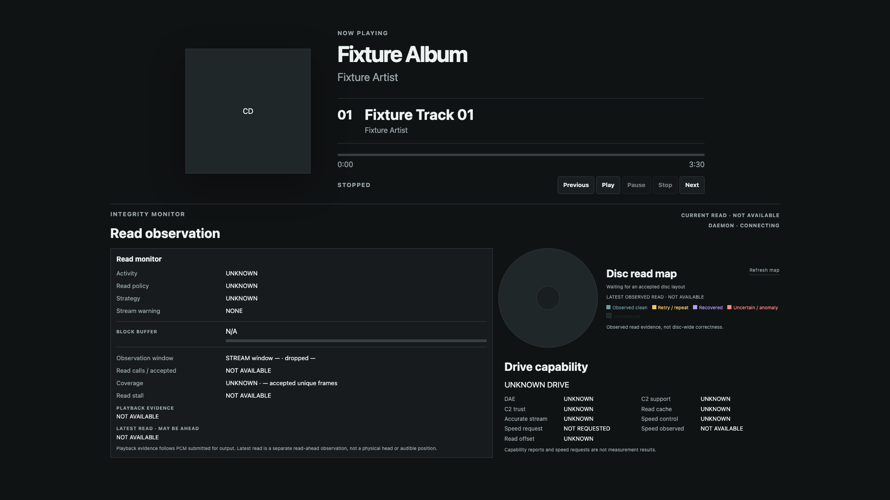
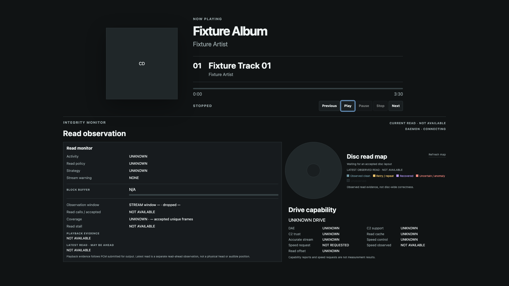

# 標準PlayerのCEC操作面：1920×1080ローカル表示確認

2026-09-30にMacのChrome headlessで1920×1080 viewportを指定して撮影した。
`ui/default/player.html/css/js`を使用し、再生状態と曲名には人工の`Fixture Album` / `STOPPED` snapshotを与えた。
2枚目はsemantic `right`を2回適用し、Play buttonへfocusを移した状態である。
CD、Drive Capability、Integrity値は実機観測ではない。この画像はレイアウトの確認資料であり、
PiのCage/Chromium、CECリモコン入力、実際の音声再生の証拠ではない。

5つのtransport buttonはPlayer情報の右下に収まり、Integrity Monitor全体も画像内に見えている。
小さいviewportへの縮退はCSSとNode UI試験の対象だが、実機TVでの可読性とfocusの見え方は未確認。
