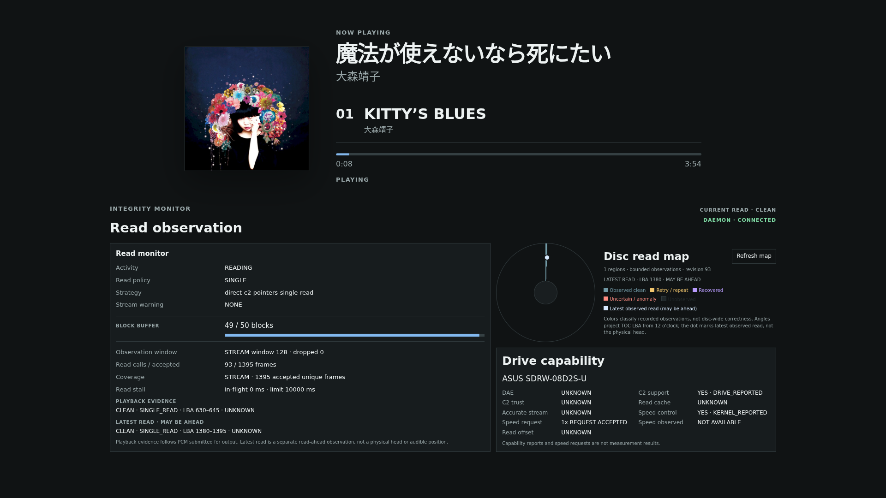
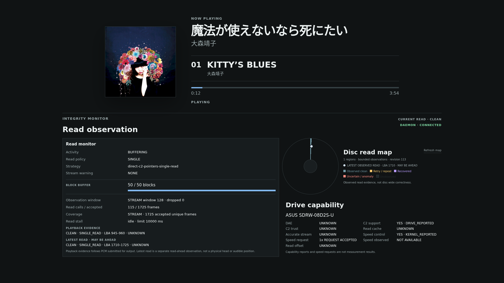

# Disc Read Map layout comparison (PR #163)

Pi kiosk ChromiumのCDPから取得した1920×1080画像と、Macのheadless Chromeで取得したfixture画像。画像はUIの比較用であり、HDMI scanoutや読み取り品質の証拠ではない。

- [変更前](before-1920x1080.png): STOPPED。以前のread historyが残る状態。円盤96px、Mapは枠付きカード。
- [初回改善・再生中](after-playing-1920x1080.png): 円盤160px、Mapの枠を消したが、DOMでは右列のMap containerに円盤を収めたままだった。
- [案A: layout直下](prototype-a-direct-grid-1920x1080.png): 円盤と説明を独立要素としてIntegrity layoutへ移し、Driveをその下へ配置。円盤240pxだがlayoutが490pxになり、従来453pxより37px高い。
- [案B: 枠なし領域](prototype-b-region-1920x1080.png): Map containerを維持し、円盤216pxと説明を内部に配置。layoutは485pxで、四角い領域としての印象も残る。
- [案C: 3カラム](prototype-c-three-column-1920x1080.png): 円盤を中央、Driveを右へ並べた案。円盤230px、layoutは453pxに収まるが、求める2カラム構図から外れるため不採用。
- [採用案・STOPPED](two-column-final-stopped-1920x1080.png): Read Observationと右側の2カラムを維持。右上は枠を持たない円盤と説明、右下はDrive capability。円盤215px、layoutは453px。
- [採用案・再生中](two-column-final-playing-1920x1080.png): 点と隣のLBAはlatest observed readであり、PCM提出位置や物理ヘッド位置ではない。
- [初回改善のmixed fixture](mixed-fixture-1920x993.png): test-only `integrity_scenario_harness`をMac Chromeで描画した当初版。
- [採用案のmixed fixture](mixed-fixture-final-1920x993.png): 同じharnessで複数観測色と最新readの点を表示。2カラムのまま情報を確認できる。headless Chromeのcapture寸法は1920×993。実CDや傷の物理再現ではない。

画像の再生状態とread historyは異なるため、色の量やread品質を前後比較する資料ではない。比較対象は配置と可読性である。案A/B/Cの画像はCDPで一時的にDOM/CSSを変更した試作で、撮影後はreloadして元に戻した。採用案のPi CDP実寸では1920×1080時にRead Observationが825×453px、枠のないMap sceneが607×215px、円盤が215×215px、Drive Capabilityが607×226px。documentのスクロール寸法は1920×1080で、Monitor全体の高さは変更前と同じ453px。1280×720では縦スクロールが生じるが横スクロールはない。700×900では1列に縮退し、450pxでも円盤215px・横スクロールなしを確認した。

初回の実画面確認で、点のLBA角度は12時起点だが、観測色のCSS角度が9時起点という不一致を発見した。両方を12時起点へ合わせ、再デプロイ後の画像で点と観測色の方向一致を確認した。実機で確認したのは通常CDのみで、mixed異常状態はtest-only fixtureの自動試験とMac Chrome描画で確認した。

Docker Desktopでharnessがcontainer loopbackだけにbindするため、文書の`docker run -p`だけではMac Chromeから到達しなかった。この撮影ではcontainer内に一時的なPython TCP relayを立て、host loopbackの公開portをharness loopbackへ転送した。relayはrepository・package・Piには含めていない。既存のmanual起動例は別途修正が必要である。

## 右列の視覚階層を再調整

基本の2カラム、Read observationの測定card、円盤215pxは維持した。Drive capabilityはCDPで[弱い枠](prototype-drive-weak-1920x1080.png)と[枠なし](prototype-drive-cardless-1920x1080.png)を試し、弱い枠では補助情報の四角い容器が残るため、透明な枠・背景を採用した。枠幅とpaddingを残して配置寸法を変えず、項目は見出しと整列でまとめる。両試作はPi CDP上でCSSを一時的に変更して撮影し、元へ戻した。以下のbefore/afterは通常再生中の別時点であり、read品質の比較には使わない。

| 変更前・Pi通常再生 | 変更後・Pi通常再生 |
|---|---|
|  |  |

[変更後・STOPPED](hierarchy-after-stopped-1920x1080.png)と[test-only mixed fixture](hierarchy-after-mixed-1920x1080.png)も撮影した。後者はMac Chromeで同じ標準Playerを描画したもので、実ディスクの傷やhardware挙動の証拠ではない。Pi側では通常CDを短時間再生して撮影後にSTOPPEDへ戻した。

latest observed readの位置を示す点は同色の記号とLBAを円盤の隣に表示し、領域色の凡例から分離した。`MAY BE AHEAD`を維持し、円盤脇の説明を「観測済みreadの根拠でありdisc全体の正しさではない」へ短縮した。TOC LBAの12時起点投影や物理headとの区別は`docs/design/functional-design.md`と`docs/manual/custom-ui.md`へ残す。手動のRefresh mapはSTOPPED時にも強制再取得できるため維持し、二次操作として色・枠を弱めた。

変更後のPi CDP実寸は1920×1080でdocumentのscroll寸法も1920×1080。1280、700、450px幅で横overflowはなく、700px以下は1列へ縮退した。mixed fixtureも1920×1080でscroll寸法一致。UIでは表示色が観測分類の簡略表示である点を維持しており、disc-wide correctnessや物理head位置を推定していない。
