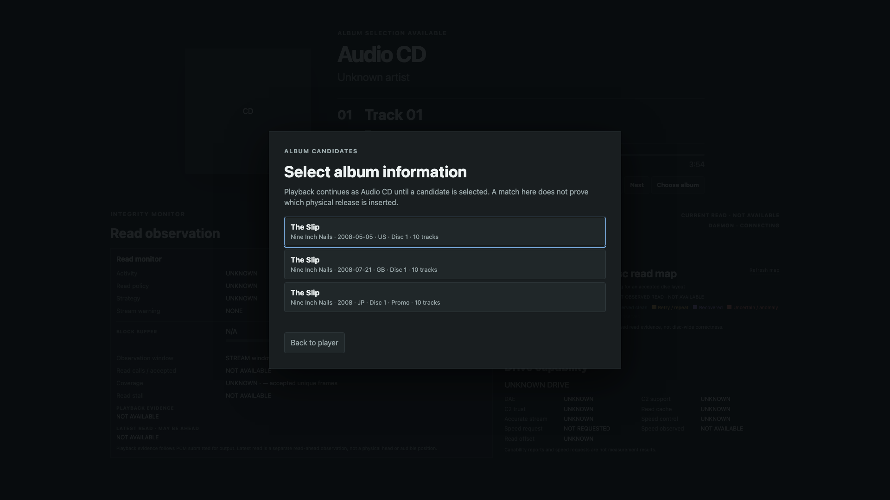

# Metadata candidate picker — 1920×1080 fixture

2026-10-01、Macのheadless Chromeを1920×1080で起動し、ローカルの固定snapshotを標準Playerへ渡して撮影した。
候補pickerはユーザーが`Choose album`を選択したときだけ開く。背景のAudio CD表示とIntegrity Monitorは
再生・読み取り実機値ではなく、fixtureの未取得値である。

候補のtitle、date、countryはレイアウト確認用の**合成データ**であり、Nine Inch Nails『The Slip』の
実際のMusicBrainz応答を記録したものではない。この画像はCEC実機入力、MusicBrainz、CAA、PiのTV表示を
検証しない。Piで実候補を選ぶacceptance testは#166で別途行う。
