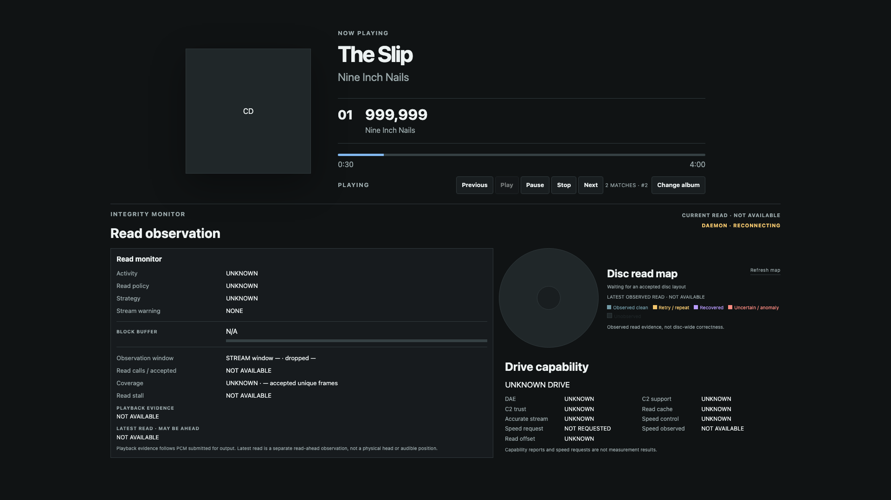
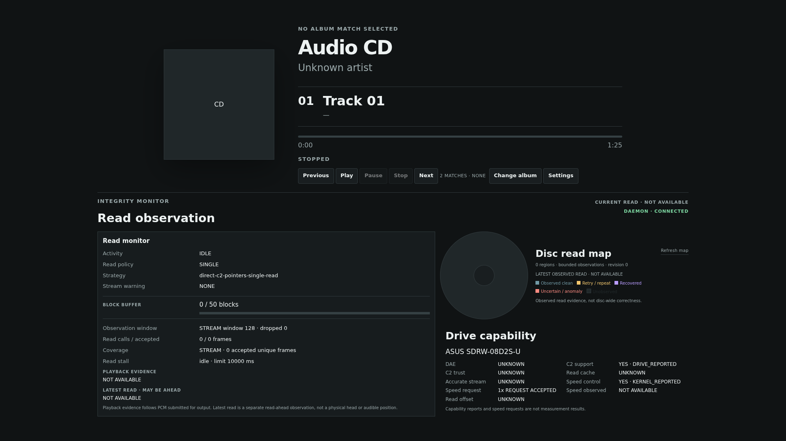

# Metadata candidate reselection — 1920×1080 fixture

2026-10-04、Macのheadless Chromeで1920×1080の標準Playerを表示した。
合成snapshotは複数候補のうち2番目を選択済みとし、候補数表示と`Change album`の配置を確認するためのもの。
画面下部のRead observation、Disc read map、Drive capabilityは実機の観測値ではない。
この画像はPiのTV表示、CEC入力、MusicBrainz応答、再選択後の音声を検証しない。

2枚目は2026-10-04にPiのChromiumをCDPで撮影した実機画像。PR #180のSettingsとPR #183を一時結合した
検証用packageを使い、『The Slip』の実候補を選択してから`None of these`を押した状態を示す。
APIではselectionが`DECLINED`、Playerは`Audio CD / Track 01`。CDPでは1920×1080のdocument overflowなし。
CECリモコンによる辞退操作と音声はこの画像では検証していない。
