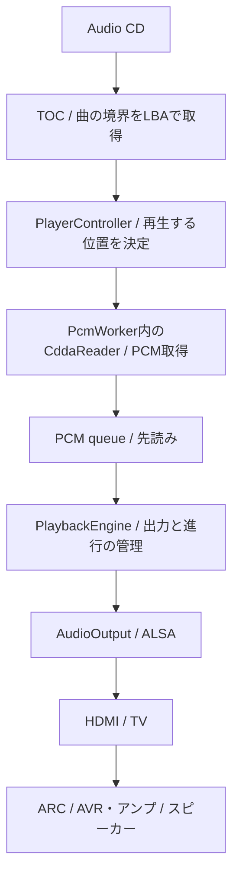

# CD-DAが音になるまで

Playを押してから音が出るまでには、読み取り位置を決め、音声データを蓄え、一定の速さで
出力へ渡す仕事がある。ここでは一曲を再生する流れを追い、それぞれを分ける理由を説明する。

最初の矢印は曲配置の取得であり、音声データがTOCを通って流れるわけではない。
音声はCddaReaderがディスクから別に読み取る。図の最後は現在の実機接続例である。

## 曲の境界から読み取り位置を決める

TOCはCDの目次に当たり、各trackの開始位置とdiscの終端を教える。曲名や音声そのものではない。
その位置を表すLBAは、読み取り単位に付けた通し番号である。trackを選ぶと、その開始LBAから
音声を読み始める。次のtrackとの境界が分かるので、曲内の位置や長さも求められる。

ここでいうCD frameはCD-DAの1/75秒分の音声であり、2352 bytesのPCMを含む。
PCMは一定間隔で記録された左右の音の値で、CD-DAでは44.1 kHz・16 bit・2 channelである。
一方、ALSAのstereo sample frameは同じ時刻の左右一組を指す。1 CD frameにはその588組が入る。
「何frame読んだか」と「何frame出力したか」を、そのまま同じ数として比べることはできない。

CddaReaderは指定位置へseekし、続くPCMを取得する共通の入口である。
directとparanoiaで取得方法は異なるが、以後のqueueと出力は同じ形式のPCMを受け取る。
この境界によって、読み取り方式の比較のために再生操作や音声出力まで作り直さずに済む。

## 読み取りの速さと、音を出す速さを切り離す

driveの読み取りは一定速度で完了するとは限らない。先読みqueueにPCMを蓄えると、
短い停止があっても音声を供給できる。queueが満杯ならworkerを待たせるため、
disc全体を無制限にメモリへ読み込むことはない。
ただし平均的な供給速度が再生速度を下回る場合、有限bufferを増やすだけでは解決しない。

例えば1秒分のPCMを読むのに一時的に長くかかっても、先読み済みの音声があれば再生は進む。
反対に、毎回1秒分を読むのに1秒以上かかれば、蓄えはいずれ尽きる。
繰り返し読み取りによる検証を加える場合も、この時間の収支を考える必要がある。

CD読み取りをworkerで行うのは、この待ち時間をmain loopへ持ち込まないためでもある。
PlaybackEngineは準備済みのPCMを取り出し、ALSAが受け取れる分だけ渡す。
残りは次の機会へ持ち越し、その間もリモコン入力や終了要求を処理する。

queueの容量と、再生を始めるまでに蓄える量は別の設定である。容量を増やすと先読みの余裕が増え、
開始量を増やすと音を出すまでの待ちが長くなる。さらにALSAにも出力用bufferがあり、
CD側に十分なPCMが残っていても、main loopからALSAへの供給が遅れれば音は途切れ得る。

## 今聞こえている位置と、seek後の位置

再生位置は、最新のread位置ではない。workerは未来の音声を読んでおり、
ALSAへ渡した音声にも未再生分が残っている。engineは送信量とALSA delayから位置を推定する。
TVやアンプの内部遅延はこの推定に含められない。

例えば30秒先へseekしたとき、すでに先読みした移動前のPCMが後から鳴ると操作の意味が崩れる。
seekでは古いPCMが混ざらないようqueueと出力bufferを破棄し、新しい位置を読み直す。
同時に世代番号を変え、進行中だった古いreadが遅れて戻っても採用しない。
ドライブの処理を即座に止められなくても、古い結果が再生へ混ざることは防げる。
そのため操作を受理してから音が出るまでに先読み待ちがある。
現在のpause再開にも同じ種類の待ちがある。設定値や計測結果はGuideへ固定せず、
[機能設計](../design/functional-design.md)と[検証記録](../development/verification.md)を参照する。

## 蓄えが尽きたとき

ALSAのunderrunは出力するPCMが不足した状態である。読み取りの停止やmain loopの遅延で
起こり得るため、発生だけで傷ディスクと断定はできない。PiCDPlayerは出力をresetして
PCMを蓄え直し、再開を試みる。その際には復旧と待ち時間を記録する。
再bufferして復旧する処理と、
CDから得たPCMの内容が信頼できるかを確かめる処理は目的が異なる。
音切れが解消しても、原盤PCMとの一致が証明されたことにはならない。

出力はAudioOutputを通す。現在の実装はALSAで、既定deviceはHDMIだが、
PlayerControllerやengineはHDMIの信号処理を直接行わない。
native再生の成立は[engineの履歴](../history/playback-engine.md)、
供給不足の調査は[media lifecycleの履歴](../history/media-lifecycle.md)に記録されている。

前：[状態を持つdaemon](architecture.md) / 次：[読み取り結果について言えること](integrity.md)
