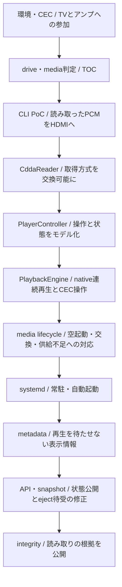

# History：プレイヤーになるまで

ここには開発途中の提案、実験、実測、修正経緯を保存している。現在の仕様そのものではない。
現行仕様は[設計書への入口](../README.md)、現在の到達点は
[検証状況](../development/verification.md)を参照する。

既存文書には複数時期の追記がある。以下は文書内の記録を段階順に辿る読書案内であり、
同じ文書へ別の節を読むために戻ることもある。記録がない日付や動機は補わない。

下図は本文で辿る問題解決の順序であり、コンポーネントの依存関係や厳密な実装日順ではない。
読み取りを交換可能にして操作をモデル化した後、native連続再生へ接続した流れを示す。

## 1. TVとアンプの構成に参加する

[第1段階](milestone-1.md)ではPiの環境、CEC device、非root権限、signal停止を確認した。
Playback Device登録後のARC復帰と、再起動後にdaemonを起動して復帰する挙動を観測した。
この時点ではPCM再生とTOCは未確認であり、次はCD側の状態を調べる必要があった。

## 2. drive、disc、曲の境界を区別する

[整理前README](readme-before-reorganization.md)の「光学ドライブ検出」から
「内部TOCモデル」までを読む。sysfsでdriveを見つけ、tray/media状態、disc種別、TOCを順に確認した。
14曲の実測からhardware非依存のDiscTocへ進んだ。曲の範囲が分かっても音声出力は別の確認である。

## 3. 読み取ったPCMをHDMIへ出す

[CD-DA / HDMI CLI PoC](cdda-poc.md)ではcdparanoiaで10秒のWAVを作り、aplayで試聴した。
読み取りと出力を分けて確認できたが、読み終えてから再生する方式では連続供給や操作応答は分からない。

[連続読み取りPoC](cdda-streaming-poc.md)はpipeで読み取りと再生を接続する試験案である。
記録上は実機確認未完了なので、その成功をnative engine成立の根拠にはしない。

## 4. PCM取得を交換可能にし、操作をモデル化する

[CDDA reader](cdda-reader.md)ではdirectとoptional paranoiaを同じseek/read境界で扱い、
保存PCMと診断値を確認した。回転・cache条件が揃わない測定からbackendの優劣は決めていない。

[PlayerController](player-controller.md)ではbackend選定を保留し、CEC操作を目標に
hardware非依存の状態・操作を実装した。workerが状態を所有せず、mainから操作を適用する境界を作った。

## 5. native連続再生とTVリモコンをつなぐ

[PlaybackEngine](playback-engine.md)の構成とPlay/Pause/Seekの記録を読む。
PCM queueとALSAを接続し、世代による旧PCM排除、部分write、ALSA delayからの位置推定を扱った。
Pause復帰の待ち時間は記録し、操作機能を優先する判断を残している。

同じ文書のCEC関連節では、follower mode、受信queue drain、遅延計測、Power Status、
Active Source応答へ進んだ。入力遅延の改善を実測し、TV側の受信前遅延や発音遅延と区別した。

## 6. 空起動とdisc交換から、供給不足の調査へ

[メディアライフサイクル](media-lifecycle.md)では、空起動、挿入、自動TOC、
取り出し・再挿入を扱うためMediaStateTrackerとMediaWorkerを接続した。

再挿入後のBroken pipeはreader再生成だけでは解消せず、診断値からPCM供給停止を調べた。
先読み量の拡大後に正常再生を確認し、さらにALSA underrunの自動復旧を追加した。
通常試聴の成功と、異常系の復旧経路を実機で検証できたことは区別して記録している。
Piハングの調査も同文書にあるが、原因は確定せず、ビルドを-j1へ制限した。

## 7. 常駐起動を確認する

[systemd実機確認](systemd-validation.md)では基本構成の自動起動からCEC再生までを確認した。
後から追記されたmetadata有効serviceの起動・cache hit確認は、基本構成の再起動試験と別の結果である。
現在のinstall手順は[Manual](../manual/systemd.md)を参照する。

## 8. 再生を待たせず曲名と画像参照を加える

[Metadata設計](metadata-design.md)では、既存DiscTocを保ち、Disc ID、候補変換、
HTTP、専用worker、CAA、cacheを段階的に追加した。
複数releaseの曖昧性とdisc交換中の古い結果を扱い、再生とmetadataの状態を分離した。
依存比較や当時のAPI調査と実装後の制約が併記されているため、現行契約はDesignを参照する。

## 9. 外部へ状態を公開し、一回のeject要求を完了させる

[Daemon state](daemon-state.md)では各ownerからsnapshotを作り、HTTP/WS公開と操作APIへ進んだ。
外部から状態を取得できる一方、操作は接続元がloopbackの場合に限る境界を設けた。

続いて[メディアライフサイクル](media-lifecycle.md)の「API eject」を読む。
LOADING中も要求を保持する処理に加え、一回の要求では開かないという報告を調査した。
再送が新しいejectを発行していないログから、API serviceによるmain loop停止を切り分け、
wake-up予約と無通信時の回帰テストを追加した。修正後は一回の要求で開くことを確認した。
初期のdrive固有動作という推測を確定原因として語らない。

## 10. 読み取りの根拠を公開する現在へ

その後の観測core、technical status、反復一致読み取りの到達点は
[検証状況](../development/verification.md)へ続く。15 frame反復時の供給不足と、
75 frame化後の正常再生・先読み待ち比較もそこにある。
[拡張案](../development/integrity-design.md)には未実装の検証方式も含まれる。
統合前の調査・要件・実装報告は[読み取り信頼性設計の保存版](integrity-design-before-integration.md)に残す。

## テーマから読む

| テーマ | 読書ルート |
|---|---|
| CD認識とPCM取得 | [旧READMEのTOC・drive記録](readme-before-reorganization.md) → [CLI PoC](cdda-poc.md) → [reader](cdda-reader.md) |
| 連続再生と音切れ | [engine](playback-engine.md) → [media lifecycleのBroken pipe・復旧調査](media-lifecycle.md) |
| 状態と交換競合 | [controller](player-controller.md) → [media lifecycle](media-lifecycle.md) → [metadata](metadata-design.md) → [snapshot](daemon-state.md) |
| CECと応答 | [第1段階](milestone-1.md) → [engineのCEC・遅延計測](playback-engine.md) |
| metadataとAPI | [metadata設計](metadata-design.md) → [daemon state](daemon-state.md) → [API eject調査](media-lifecycle.md) |

[整理前README](readme-before-reorganization.md)は当時の全体像を保存した資料として維持する。
履歴へ現行仕様を追記して上書きせず、新しい実測を記録する際は条件・観測・未確認範囲を分ける。
