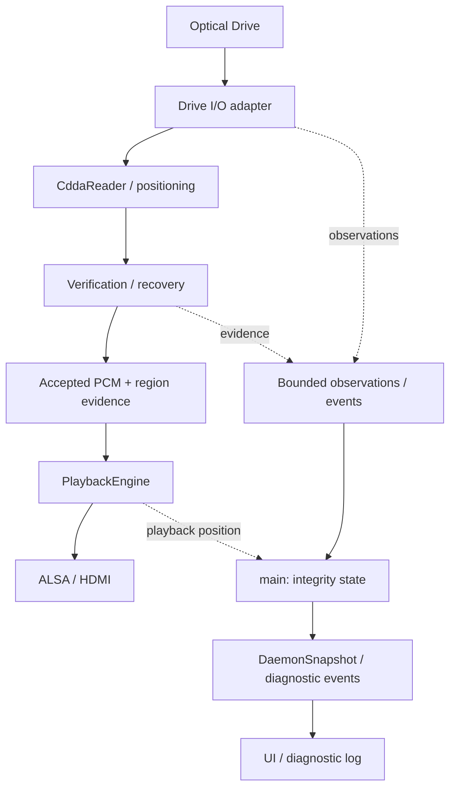
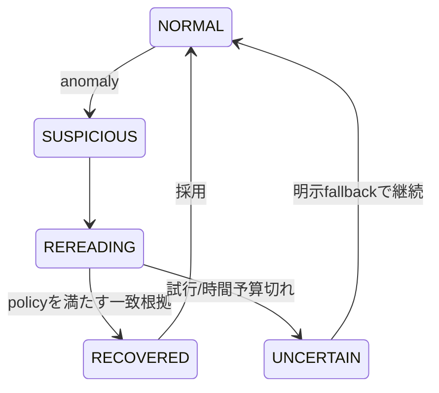

# 読み取り信頼性・説明可能性の拡張設計案

状態: Phase 1aは実装・通常CDで実機確認済み。Phase 1b、Phase 2の基礎、Phase 3の反復一致判定は実装・自動試験済みで実機確認前。
設計基準はcbf458e。既存仕様の置き換えではなく、段階的な拡張案である。
ユーザー提示の「Explainable Secure CD-DA Player」の要求を本repositoryの構成へ対応付ける。
最初の実装では既存readの観測値をPCM blockとsnapshotへ伝搬し、read-only能力probe、
bounded event、ALSA再生headに対応する根拠の推定を追加した。新しいmode、検証/recovery algorithm、
専用diagnostic event endpoint、UIはまだ利用できない。

## 1. 目的と原則

「現在再生しているPCMを、どの観測と検証に基づいて採用したか」を説明する。
音質改善や原PCMの完全な復元を主張する機能ではない。
優先順位はcorrectness、truthfulness、explainability、drive independence、graceful degradation、
playback continuity、quiet operation、extensibility、UI simplicityとする。

- read成功は証拠であり、正しい原PCMの証明ではない。
- C2非検出、複数read一致、外部照合成功、offset補正は別々の事実である。
- capability UNKNOWNをNOへ、offset不明を0へ変換しない。
- backend名やSECUREという設定だけを根拠に「検証済み」と表示しない。
- UI/診断接続の停止・遅延がaudio処理を待たせてはならない。
- 不明・未解決・代替PCMの使用を隠して再生継続を成功扱いにしない。

## 2. 現状調査と差分

### 追加dependencyの調査

Phase 1aは標準C++20、既存Linux UAPI、既存API buildのnlohmann/jsonだけで実装でき、
新しいlibraryを追加しない。Raspberry Pi OS上で既存のALSA 1.2.14、libwebsockets 4.3.5、
libdiscid 0.6.4、libcurl 8.14.1、nlohmann/json 3.11.3を確認した。
CRC比較は最初から外部hash libraryを要求せず、Phase 3で衝突時のPCM bytes比較を含めて選定する。
MMC/C2/cacheはlibrary導入を先に決めずLinux SG_IO/CDROM packet経路とdrive/bridgeの挙動を調査する。
AccurateRip等はPhase 5でprotocolと利用条件を確認してから依存を決める。

| 領域 | 現在の実装 | 追加が必要なもの |
|---|---|---|
| drive | sysfs identity、media/TOC、read-only能力probeとUNKNOWNモデル | MMC/C2/cacheのreport・実測trust、速度、offset |
| CD-DA | CddaReaderのseek/read、direct/paranoia | 観測保持、region検証、採用理由 |
| 読み取り結果 | ReadResultとblock単位のevidence・集計 | 独立性、C2、詳細provenance |
| PCM | 15 sector block、generationとevidence付きbounded queue | 容量設定、region分割、複数候補 |
| 出力 | PlaybackEngine→ALSA。delayから再生headのevidenceを推定 | TV/ARC以降を除く精度評価、供給状態 |
| 状態 | main所有のPlayer/Media/Metadataとdrive/read値モデル | policy、active warning、coverage |
| UI/API | snapshot配信と読み取り専用technical status renderer | TV向け本番UI、専用diagnostic stream |
| ログ | RECOVERED/UNCERTAIN eventの診断行 | provenanceとevent gapの診断 |
| 設定 | CLI・systemd EnvironmentFile、任意CMake機能 | mode/policy、buffer・retry上限 |
| 試験 | fake reader/audio、能力UNKNOWN、evidence、世代、snapshot、loopback API | 検証・provenance・event欠落の試験 |

現在のdata pathは `/dev/sr0 → CddaReader → PcmWorker queue → PlaybackEngine → ALSA → HDMI`。
TOC取得は別のMediaWorkerから行う。PcmWorkerはReadResultの成功・frames_readを確認するが、
retryやparanoia統計を再生blockへ引き継がない。paranoia callbackの位置引数も現在は保存しない。
よって過去の統計からsector別の訂正や一致回数を後付けで推定できない。

状態はmainで更新しDaemonSnapshotを作り、250 ms間隔で変化を検査して公開する。
現行の`WS /api/events`は出来事の履歴ではない。UIはまだなく、technical status表示も未実装。
CD readと出力のthread分離は既にあるため、Phase 2で再設計しない。

## 3. 拡張後の構成と所有権



Drive Adapterは責務の境界であり、初期段階で全backendを巨大なclass階層へ置き換えない。
既存LinuxIoctlReaderのtransport callback、MediaWorkerのcallbackをprobe/試験の差し替え点に使う。
vendor/model固有の対応が必要になったらadapter側へ閉じ込め、適用条件と根拠を公開する。

PCM reader・検証器はPcmWorker側、PlayerStateと公開integrityはmain側で所有する。
検証はPCMを採用する前の処理であり、UIとは独立。観測は小さな値をqueueで渡す。
既存TOC、metadata、CEC、ALSAを別のlibraryへ移さない。追加thread poolは不要。

## 4. データモデル案

ここでの名称は概念案。既存PlaybackStateを再定義しない。

| 型 | 主な情報・寿命 |
|---|---|
| CapabilityValue<T> | optional value、evidence一覧、観測時刻、適用範囲、probe error |
| DriveCapabilities | identity、DAE、C2 support/trust、cache、accurate stream、speed control、offset |
| DriveState | device generation、接続/probe状態、要求速度・報告速度・実測throughput |
| ReadPolicy | 希望する検証、時間/試行予算、buffer、未解決時動作 |
| ReadStrategy | 選択された手順、使用backend、利用可能な観測、降格理由 |
| ReadState | IDLE/READING/VERIFYING/RECOVERING/BUFFERING/FAILED、read対象区間 |
| RegionIntegrity | 区間、観測・比較・独立性、offset、採用理由、policy revision |
| IntegrityStats | 試行数、採用区間、recovered/uncertain量、外部照合範囲 |
| ReadProvenance | 問題区間のReadAttempt一覧、採用候補、比較とfallbackの理由 |
| PlayerEvent | machine-readable type、severity、presentation、世代・区間・payload |

bool能力はYES/NO/UNKNOWN。数値不明はnull。根拠はKERNEL_REPORTED / DRIVE_REPORTED /
TESTED / DATABASE / USER_CONFIGURED / INFERREDを区別し、raw根拠と試験条件を残す。
相反する根拠も一方を消さず保持し、採用した判断を示す。TESTEDは条件内での確認であり永久保証ではない。

RegionIntegrityは一次元scoreにせず、次の軸を独立に持つ。

| 軸 | 値案・意味 |
|---|---|
| read_status | UNKNOWN / CLEAN / RECOVERED / UNCERTAIN。CLEANは利用できた観測で異常なし |
| local_verification | NONE / SINGLE_READ / MULTIPLE_MATCH。比較対象範囲と回数を併記 |
| read_independence | UNKNOWN / CACHE_POSSIBLE / CACHE_MITIGATED。物理再読込の保証とはしない |
| external_verification | NOT_CHECKED / UNAVAILABLE / MATCH / MISMATCH、照合方式・範囲・confidence |
| offset_status | UNKNOWN / UNCORRECTED / CORRECTED、値・source・補正範囲 |
| c2_status | UNKNOWN / NOT_AVAILABLE / NOT_CHECKED / CLEAN / REPORTED |
| sample_origin | READ / SILENCE / INTERPOLATED。置換した区間を明示 |

C2非対応、C2取得を行っていない、取得したが非検出、を区別する。
paranoiaのverify/fixup callback件数をMULTIPLE_MATCHや訂正sector数に直接変換しない。
Phase 1では「libraryがこの種類のcallbackを報告した」までをevidenceとする。

## 5. 再生位置と根拠の対応

先読み中のLBA、queue内の採用済みLBA、ALSAへ送信済みLBA、再生位置推定値を分ける。
future regionのrecoveryを、現在聞こえるPCMのrecoveryとして表示しない。

PcmBlockへ軽量なregion evidenceまたは有効な参照を付け、部分ALSA write後も範囲を保持する。
一つのblock内で状態が違えば半開区間[start_lba,end_lba)へ分割する。
offset補正後の細かな境界はstereo sample frame単位で併記する。
ALSA delayで消費済みと判定するまで送信済みregionの根拠を保持し、current integrityを引く。
出力device以降のTV/ARC/アンプの遅延やbit一致はこの位置推定と保証の対象外。

device generation（再接続）、disc generation（観測した交換）、stream generation（seek/再開）、
policy revisionを明示し、古いPCM・観測・検証結果を現行状態へ適用しない。
UNKNOWNな区間をtrack全体のCHECKED表示で覆わない。track集計は検査済みcoverageと未検査coverageを持つ。
同じsectorの再試行はattempt数へ、distinctな採用sectorはcoverageへ計上して重複加算を避ける。
seekでcoverageに穴がある場合、track checksum完成とはしない。

## 6. PlaybackMode / ReadPolicy / ReadStrategy

`PlaybackMode → ReadPolicy + DriveCapabilities + backendの観測能力 → ReadStrategy`とする。
direct/paranoiaはbackendでありQUIET/BALANCED/SECUREとは別。paranoiaを選ぶだけでSECUREとはしない。
Phase 1では現行方式をLEGACY相当として明示し、未実装のmodeをCLIで受け付けない。
将来はrequested mode、effective strategy、満たせない条件・降格理由を同時に公開する。

| mode | policy案 |
|---|---|
| QUIET | 騒音と連続再生優先。取得可能な異常時だけ限定retry。無検証を検証済みとは表示しない |
| BALANCED | 通常区間は軽量な観測/overlap、疑わしい区間だけ追加read。将来default候補 |
| SECURE | 同一区間の複数read・cache対策・整列比較を優先。必要ならbuffering待機 |

ReadPolicy候補はminimum_matching_reads、maximum_attempts（初回込み）、region_time_budget_ms、
preferred_speed、noise_priority、target_buffer_frames、startup_buffer_frames、overlap_frames、
c2_policy、cache_policy、allow_playback_stall、unresolved_data_policyとする。
desired_confidenceは手順への要求であり、根拠のない確率値では表さない。
retry回数・比較回数・library内部retryを分け、二重retryで予算が膨張しないようbackend別に計上する。

未解決時はSTOP / BEST_AVAILABLE / SILENCE / WAIT_WITH_BUDGETを明示的に選ぶ。
Phase 1は現在のread失敗時停止を維持。QUIETの継続方針は後続phaseで導入する。
有効な候補がないBEST_AVAILABLEでは未初期化/古いPCMを使わずSTOPへ移る。
無音を使う場合もUNCERTAINかつsample_origin=SILENCEとする。複雑な補間は初期実装の対象外。
waitにも期限と最終動作を持ち、無期限retry・stallを避ける。ただし進行中kernel ioctlは強制中断できない。

## 7. NO DISCでの能力probe

Phase 1のprobeはread-onlyかつ任意失敗可能。discなしでも取得できる情報だけを返す。
probe failureはcapability NOではなくUNKNOWN+error。起動/再生可能化をprobe完了の条件にしない。

| 情報 | 取得候補と扱い |
|---|---|
| vendor/model/firmware | 既存sysfs device/vendor, modelにrevを追加。欠落はUNKNOWN |
| kernelが公開する機能 | CDROM_GET_CAPABILITY。driver/interface側の根拠として保持 |
| DAE | 後続phaseでMMCのreportを調査。成功したAudio readはTESTEDとしてその条件を記録 |
| C2/accurate stream/cache | 後続phaseでMMC inquiry/mode page等を調査。reportと実測trustを別管理 |
| speed control | CDC_SELECT_SPEEDはkernel report。実際の設定可否・効果は別途確認 |
| supported/current speed | 未取得ならUNKNOWN。要求2xやread所要時間からcurrent speed=2xと断定しない |
| read offset | database/calibration/user設定導入まではUNKNOWN。vendor/modelだけで自動断定しない |

Linux CDROM_GET_CAPABILITYにはC2 trustやoffsetの直接的な情報はない。
CDC_PLAY_AUDIOをDAE成功の証明として使わない。
CDROM_SELECT_SPEEDは設定操作なのでPhase 1のprobeでは実行しない。
MMC command transportはSG_IO等を候補とするが、CDB、response長、sense、権限、bridge越しの可否は
実装phaseで仕様と実機を調査して確定する。generic packet対応だけで全MMC機能が使えるとはしない。

probeはMediaWorkerで逐次実行し、reader稼働と重ならない条件で要求する。
待機中はUNKNOWNを公開。hotplug/resetでは能力snapshotを無効化し、driveなしとdiscなしを分ける。
速度変更・cache対策の追加前にdevice I/Oの調停を整え、ejectを優先する。
Phase 1に能動的cache/C2精度試験やトレイ操作は含めない。

確認資料: 実機の`/usr/include/linux/cdrom.h`、`/usr/include/scsi/sg.h`、
[Linux CD-ROM ioctl](https://docs.kernel.org/userspace-api/ioctl/cdrom.html)、
[Linux SCSI Generic](https://docs.kernel.org/scsi/scsi-generic.html)。
これらはLinux入口の確認であり、MMC全機能やこのASUS driveの能力を確認したものではない。

## 8. bufferと検証・recovery

既存bounded dequeを維持し、必要性が実測で示されるまでring bufferへ置き換えない。
15 sector/blockを維持し、開始閾値・上限をCD frame単位で設定できる。既定は開始10 block=2秒、
上限20 block=4秒で従来動作を保つ。
BALANCEDの10〜30秒は評価候補であり、今すぐ既定値にしない。
PCM単体は176400 bytes/秒なので10秒約1.68 MiB、30秒約5.05 MiB。
比較用候補・overlap・provenance・ALSA bufferの予算も別途上限を持つ。
buffered時間はqueue・engine未送信分・ALSA delayを分け、二重計上しない。

Phase 3では既存seek/readを包むverification layerから必要な前後区間を読む。
paranoiaの連続読み取り状態を壊すstateless read_regionへの全面変更は行わない。
overlap/複数readを提供できるbackendの組合せを明示し、使えないstrategyは降格する。
比較前にbyte order・サンプル位置・offset条件を統一し、overlap分を二重再生しない。
disc端を越える読込は要求せず、検証不能な端区間を明記する。



UNCERTAINからSTOPするpolicyもある。overlap不一致は不連続の疑いであり、欠落/重複の原因を即断しない。
CRCは候補グループ化・診断用。可能なら最終的な一致判定はPCM全bytesで行い、CRC衝突を同一視しない。
「3回一致」は回数と比較条件を示す。cacheを排除できないreadの独立性はUNKNOWN/CACHE_POSSIBLE。
cache defeatやdistant readをしただけで物理再読込を保証したとはしない。

offsetは正負付きstereo sample frame単位（両channelで同じ時間位置）とする。
採用databaseの符号規約を明記し、補正で必要な端データが読めない場合はその範囲を不明/代替扱いにする。
speed設定非対応ならdrive既定、C2不可なら利用可能なoverlap/repeated read、offset不明なら未補正で再生する。
ALSA underrun復旧は出力継続の処理であり、read integrityのRECOVEREDとは別のeventと統計にする。

## 9. provenance・統計の上限

ReadAttemptは区間、attempt番号、digest/比較結果、C2情報、read所要時間、cache対策、errorを持つ。
ReadProvenanceはaccepted attempt/candidate、matching count、acceptance_reason、policy revisionを持つ。
正常区間は同じ根拠をまとめ、問題区間だけ詳細を残す。

初期案はrecent events 256件、問題region詳細128件、各regionのattempt詳細16件。
件数に加えbytes上限を設定し、overflow/eviction数とdetail_availableを公開する。
長い履歴を捨ててもaggregateと現在再生に必要な根拠は保持し、未記録を「問題なし」にしない。
統計はdisc/stream別のscopeとcoverageを付ける。unknown件数を0件成功として表示しない。
永続JSONLログは任意。容量・rotation・書込み失敗を制限し、worker/mainを同期disk writeで待たせない。
永続ログを実装する段階で専用のbounded出力経路を検討する。

## 10. player → UI protocol案

既存GET /api/stateおよびWS /api/eventsのsnapshot形式を維持し、drive/read/integrityを追加する。
schema_versionを追加し、未知fieldを無視できるclient方針を定める。
`persistent state`は再接続時に取得できる現在値の意味であり、disk永続化を要求しない。

snapshotはrequested mode/effective strategy、capabilities、read activity、buffer、
current playback regionのintegrity、coverage/stats、active warnings、last_event_sequenceを含む。
警告が解消したかもstateで保持し、eventを逃しても復元できる。
UIはread activityとcurrent playback integrityを別表示する。

Phase 1aでは直近64件のbounded eventをsnapshotの`recent_events`に含め、既存WebSocketでも
snapshot更新として配信する。通常成功はDEBUGとして行ログへ出さず、RECOVERED/UNCERTAINを記録する。
worker側のevent queueは256件を上限とし、溢れは`read.dropped_events`に表す。
履歴の再送、gap検出、詳細provenanceが必要になる段階では新しい`WS /api/diagnostics`（仮称）を用意し、
既存eventsへ異種messageを混ぜない。将来のイベント例:

```json
{
  "schema_version": 1,
  "session_id": "daemon-instance",
  "sequence": 42,
  "disc_generation": 3,
  "stream_generation": 7,
  "monotonic_ms": 123456,
  "type": "read_retry",
  "severity": "INFO",
  "presentation_priority": "ACTIVITY",
  "region": {"start_lba": 18342, "end_lba": 18343},
  "payload": {"attempt": 3, "reason": "pcm_mismatch"}
}
```

event sequenceとsnapshot revisionを分ける。再起動でsession_idを変える。
接続時には最新snapshotを取得し、そのlast_event_sequence以後を適用する。
順序境界はmain threadで確定し、ring保持範囲外ならgapと最新snapshotを返す。
replayはbounded、slow clientはcoalesce/dropまたは切断し、audioをbackpressureしない。
drop件数を明示し、欠けたprovenanceを再構成したように見せない。

severityはDEBUG/INFO/WARNING/ERROR、presentationはBACKGROUND/NORMAL/ACTIVITY/IMPORTANT/STICKY。
recovery進行は通常INFO+ACTIVITY、未解決PCMはWARNING+STICKY。
backendはreason codeを送り、UIが翻訳・dedup・coalesce・最小表示時間・priority overrideを行う。
最小表示時間の初期候補は1秒。sticky解除条件はwarning stateの解消/確認とし、通常progressで消さない。

NO DISC画面はdrive名・能力・根拠・UNKNOWNを表示する。discなし時にintegrityをCLEANと表示しない。
通常画面の1行statusは読み取り/先読み/比較/回復を表現し、詳細から採用理由へ進める。
"PCM verified locally"単独の断定表示は避け、「同一区間を3回比較し一致、cache独立性不明」等の根拠にする。
NO DISC表示やtechnical statusはproduct機能だが、Chromium kiosk化とは別の小さなUI段階として扱う。

## 11. 外部検証

Phase 5でAccurateRip等のprotocol・checksum・offset規約・利用条件を改めて調査する。
MusicBrainz Disc IDや曲名一致をPCM検証と混同しない。
外部照合は方式・version・track identity・coverage・offset・confidence値を伴う独立した結果とする。
confidenceを一般的な正解確率へ変換しない。MISMATCHだけでdrive故障を断定しない。
track末尾で結果が出てもよい。seek/skipや未解決・代替PCMによりchecksum入力が不足した場合は
NOT_CHECKED/UNAVAILABLEと理由を返し、追加rippingを自動で開始しない。
外部照合失敗でも再生を止めず、履歴のlocal evidenceを上書きしない。

## 12. 移行phaseと完了条件

| Phase | 小さな実装単位 | 完了条件 |
|---|---|---|
| 1a Observable core | 能力のUNKNOWNモデル、既存read統計、PCM世代/区間との対応、snapshot/event・診断ログ | 実装・通常CDで実機確認済み。read-only能力probe、bounded event、ALSA再生head推定を含む |
| 1b Observable presentation | NO DISC能力表示、technical statusの小さなrenderer、event受信 | 実装・自動試験済み、実機確認前。snapshot再取得で復元し、kiosk化は別作業 |
| 2 Buffered Reader | 既存queueの容量/閾値設定、device I/O調停、速度設定と失敗fallback | 容量/閾値と直列化を実装・自動試験済み。速度設定と実機評価は未実装 |
| 3 Checked Reading | overlap・候補比較・bounded recovery・provenance、BALANCED | 2-of-3反復一致とprovenanceは実装・自動試験済み。overlap/cache対策と実機評価は未実装 |
| 4 Drive-aware Secure | MMC/C2、cache評価/対策、offset、strategy選択、SECURE | 対応driveと根拠を実測、非対応は明示降格。QUIETもpolicyとして確認 |
| 5 External Verification | checksum/照合、confidence・coverage、遅延結果 | 部分再生/交換/外部障害を誤ってMATCHにしない |

各phaseで設計レビュー→hardware非依存試験→ユーザーによる実機確認を行う。
Phase 1aでは新規依存、reader API全面変更、追加drive read、速度変更を導入しない。
CMakeはモデル/集計テストを基本buildへ、JSON/API試験をENABLE_APIへ分ける。
ENABLE_METADATA=OFF / ENABLE_API=OFFでも観測coreと再生は利用可能にする。
追加runtime optionはそのphaseで機能が成立したものだけ公開し、未実装指定を成功扱いしない。
実機確認可能になるまではPhase 2の速度設定を有効化せず、Phase 3のhardware非依存な比較・provenanceモデルを先行できる。

### Phase 1aの実装済み範囲

`ReadResult`から、LBA、要求/取得frame、direct retry、paranoia callback集計を`ReadEvidence`へ変換する。
PcmWorkerはaccepted PCM blockへevidenceを付け、stream開始からのboundedなaggregateを保持する。
seek/stop等で世代が変わった古いread結果は、現行streamのevidenceや統計へ加えない。

API snapshotには`schema_version=1`、`drive`、`read`、`recent_events`を追加した。`read.latest`は
最新の先読み結果、`read.current_playback`はALSAへ提出した区間とALSA delayから推定した再生headである。
後者はTV/ARC/アンプ内部の遅延を含まず、実際の音響出力時刻の保証ではない。
direct成功readは`CLEAN + SINGLE_READ + C2 NOT_CHECKED + offset UNKNOWN`。
CLEANはそのreadで利用可能な異常を観測しなかった意味で、原PCMの検証済み表示ではない。
direct retry後の成功は異常があったのに一致検証していないためUNCERTAINとする。
paranoiaがfixupを報告してPCMを返した場合はRECOVERED + BACKEND_REPORTEDとする。
いずれも原PCMの証明ではない。
paranoiaのverify/fixup callbackがある場合も`BACKEND_REPORTED`とし、複数独立read一致とは表示しない。
既定requested modeはLEGACY、effective strategyはdirect-single-read/paranoia-libraryである。

DriveCapabilitiesは起動後にMediaWorkerで非同期probeする。sysfsのvendor/model/revと
`CDROM_GET_CAPABILITY`の`CDC_SELECT_SPEED`だけを根拠付きで公開し、DAE、C2、cache、
accurate stream、offsetはUNKNOWNのまま保つ。probe失敗もNOへ変換せず`probe_error`へ保持する。
このprobeはdisc認識や再生可能化の条件ではない。

各accepted blockからREAD_OBSERVED eventを生成し、stream generationとLBA区間を持たせる。
seek/stop/ejectで旧世代のqueueとeventを破棄する。通常成功はDEBUG、backend回復報告はINFO、
未確実な結果はWARNINGとする。eventやAPIの消費がaudio workerへbackpressureを返さないよう、
worker queueとsnapshot履歴はいずれもboundedとした。

### Phase 1bの実装済み範囲

API buildは`GET /debug/status`で読み取り専用のtechnical status画面を提供する。HTML/CSS/JavaScriptは
daemonへ埋め込み、追加runtime、静的asset directory、Node.jsを要求しない。画面はplayer、現在位置、
current/latest evidence、集計、drive能力と根拠、disc/metadata、直近8件のeventを表示する。
NO DISCではread evidenceをCLEANと表示しない。

初回とWebSocket再接続時に`GET /api/state`から全状態を復元し、その後`WS /api/events`のsnapshotで
更新する。event履歴だけから状態を再構成しないため、切断中のevent欠落を正常状態と誤認しない。
画面は操作APIを呼ばず、metadata等の外部文字列をHTMLとして解釈しない。本番TV UI、画像表示、
Chromium kiosk、個別event replayや専用diagnostic streamはこのphaseに含めない。

### Phase 2の実装済み範囲

既存dequeと15 frame/blockを維持したまま、容量と開始閾値をCD frame単位のruntime optionにした。
既定300/150 frameは従来の4秒/2秒と同じ。最大2250 frame（30秒）、15 frame刻み、開始は容量以下に制限し、
設定値をsnapshotとtechnical statusへ公開する。underrun後のadaptive prebufferも選択容量を越えない。

DriveAccessCoordinatorをplayer sessionごとに一つ作り、PcmWorkerのreader操作とMediaWorkerの
media/TOC/eject/capability操作を直列化した。main threadはmutexを取得しない。eject時はstream停止と
reader解放を先に行う既存順序を維持する。kernel/library callの途中cancel、速度設定、適切なbuffer値の
決定は実機依存のため未完了である。

### Phase 3の実装済み範囲

`--read-verification repeat`では既存readerをdecoratorで包み、75 CD frame（終端のみ短縮）の同一区間を最大3回読み、
PCM全sampleが同一の候補を2回得た場合だけ採用する。A/AだけでなくA/B/Bも扱い、CRC衝突を一致としない。
試行は最大3回、一区間10秒、候補memoryは最大3 blockに制限する。時間上限は新しい試行を始める前に判定し、
進行中のkernel/library read自体を中断する保証ではない。

一致しなければ候補PCMを出力せずread failureとして再生を停止する。A/B/Bのように不一致後に一致候補を
採用した区間はRECOVERED、A/AはCLEANとし、どちらも`MULTIPLE_MATCH`と試行数を公開する。
これは同一deviceから同じbytesを得た事実であり、drive cacheから独立したreadや原盤PCMとの一致を証明しない。
通常CDで15 frame regionを反復した実機試験では1 regionに約359 msを要し、0.2秒分のPCM生成が再生に
追いつかずunderrunした。このためrepeatだけregionを75 frameへ拡大し、queueは従来どおり4秒容量・2秒開始とした。
既定は`--read-verification single`相当で、従来のread回数と再生動作を変えない。overlap、cache defeat、
速度制御、BALANCED/SECURE policyはまだ実装していない。

## 13. 試験計画

すべて以下は新規計画であり、既存CTestによる検証済み主張ではない。

- モデル: UNKNOWN/NO、C2 support/trust、offset null/0、根拠の競合と失効。
- policy: mode変換、能力不足時のstrategy降格、attempt/時間/memory上限、fallback選択。
- 正常fake reader: 読み取り回数とPCMがPhase 1で不変、single readをCHECKEDとしない。
- 異常fake reader: C2報告かつ一致、A/B/B/B、不一致継続、部分read、位置ずれ、read failure。
- cache fake: キャッシュ同一結果を独立3回readとしない。C2不可でもstrategyが成立する。
- PCM境界: overlapの欠落/重複防止、offset正負、disc端、byte order、CRC衝突時のbytes比較。
- playback: 部分write、ALSA delay、starvation、underrun、先読み区間と可聴位置の分離。
- lifecycle: seek/stop/eject中のread完了、disc A→B、旧event・旧external resultの拒否。
- provenance: reason生成、unique coverage、ring eviction、現在再生分の保持、欠落の明示。
- protocol/UI: serialization、sequence gap、再接続、priority、dedup、最低表示時間、sticky警告。
- 分離: API無効、UI切断、slow client、診断log失敗でもaudio queueが待たない。
- 外部照合: track全域/部分、offset条件、match/mismatch/unavailable、代替PCMを含む区間。

試験は既存fake callbackを拡張し、余分なthreadを作らずdeterministicに予算を検証する。
実機では空driveのprobe、通常CDの差分なし再生、操作応答、能力reportと実測の差を順に確認する。
傷disc、cache defeat、速度変更、長時間readはコマンド・期待結果を提示してユーザーが実行する。
実機でC2の信頼性やoffsetを未確認のままTESTEDにしない。ビルドは引き続き-j1。
